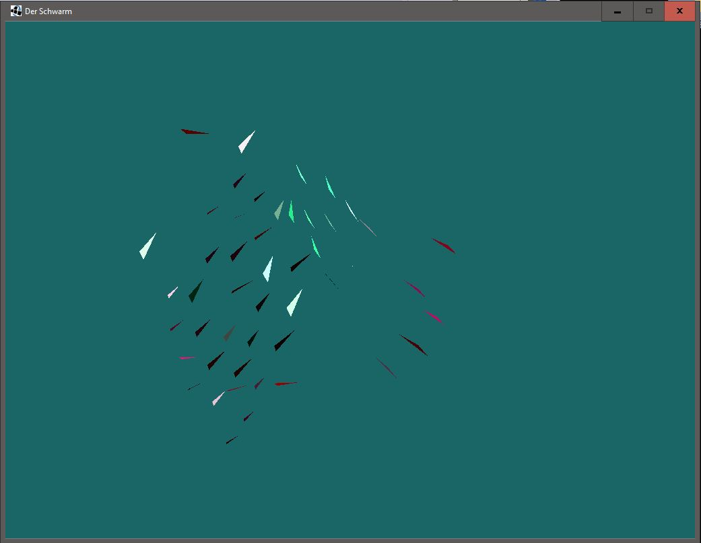

# Schwarmverhalten 

In der CG_Shader\CGVIS_Workspace\VL_CGII_2014\src\Beleg
befindet sich das Schwarmverhalten.java, mit der lässt sich das Projekt öffnen.

Im dem Projekt wurde Strategy- und singleton-Pattern verwendet

